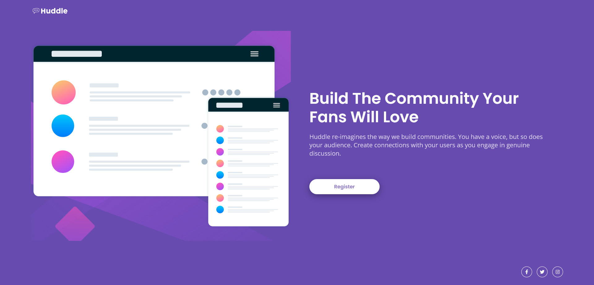

# Frontend Mentor - Huddle landing page with single introductory section solution

This is a solution to the [Huddle landing page with single introductory section challenge on Frontend Mentor](https://www.frontendmentor.io/challenges/huddle-landing-page-with-a-single-introductory-section-B_2Wvxgi0). 

This project uses **HTML** and **vanilla CSS** to implement a *mobile first*, *responsive* design. The screenshot of the finished product can be seen below.

### Tech stack:

- [x] HTML to create the structure
- [x] vanilla CSS to design the webpage
- [x] Grid and flex layouts to implement the design.
- [x] BEM naming convention in writing CSS

### Process

- Firstly, to start off the project, I navigated to a newly created directory and created an empty git repo inside using `git init` command. The **Frontend Mentor - Huddle landing page with single introductory section challenge** repository is cloned in the created repo.
- Next, all the unused files, inline CSS etc were removed. Font families were added to the project using *Google Fonts CDN*. All the colors provided in the *style-guide.md* were added to the `:root` of the CSS. 
- The main page sanning the full viewport with appropriate background color was implemented. 
- The `card` component was implemented using *mobile first* design. The contents were added keeping *responsive design* in mind.
- Added media query to look according to the `designs` using `375px` for `mobile` and `1440px` for `desktop` breakpoints. The static page was tested on various viewports/devices using the Firefox mobile layout viewer. 
- A screenshot of the final result was taken using **Firefox screenshot** and was added to the project.

### Tools used

- VS Code as the Code Editor
- Live server VS Code extension to create a dev server
- Prettier pluggin for code formatting
- FontAwesome for social icons

### Links

- Solution URL: [Github](https://github.com/kanuos/FEM-huddle-landing)
- Live Site URL: [Github Pages](https://guileless-maamoul-9320cd.netlify.app/)

### Author

- Frontend Mentor - [@kanuos](https://www.frontendmentor.io/profile/kanuos)
- GitHub - [@ykanuos](https://github.com/kanuos)
- GitHub - [@ykanuos](https://gitlab.com/kanuos)

### Work progress 

- [x] add index.html
- [x] import fonts
- [x] add images
- [x] add icons for the website
- [x] added favicon
- [x] remove default styling
- [x] add external css file
- [x] link external css file with HTML
- [x] add a global reset
- [x] add font families to the CSS
- [x] header component
- [x] mobile first content
- [x] Tablet view
- [x] Desktop view
- [x] Update readme
- [x] Clean 
- [x] Deploy to Github
- [x] Host using github pages

